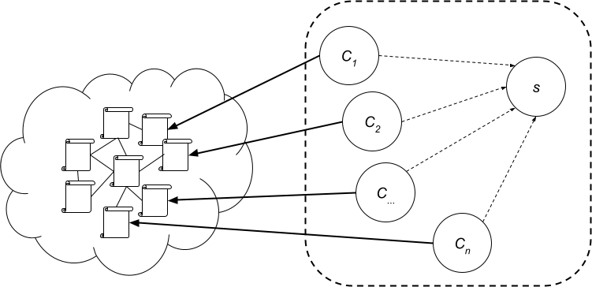

# DVA500-WebCrawler

[DVA500: Industriella system i datamoln](https://www.mdu.se/utbildning/kurser?kod=DVA500): WebCrawler is a containerized web crawler that explores the internet, fetches HTML pages, extracts links, and visits each page only once. It is built on a client server architecture.

## Architecture Diagram



This diagram shows the interaction between clients and the server, where clients fetch HTML pages, check with the server to avoid revisiting, and extract links for further exploration.

## Requirements

- Docker
- Python 3.9 or later
- Poetry 
- Make

## Setup Instructions

### Development Setup     

Poetry is used for dependency management, versioning, and packaging during development. Runtime requires Docker and Make.

Note: Running the server/clients via `poetry run` is not supported. Use Docker/Make below.

1. **Clone the repository**

    ```bash
    git clone https://github.com/erdemonal11/DVA500-WebCrawler.git
    cd DVA500-WebCrawler
    poetry install 
   
2. **Build and run the web server**
    ```bash
    make create_web
    
3. **Run the server**
    ```bash
    make run_server
    
4. **Run the clients:**
   You can specify the number of client instances to run
    ```bash
    make run_clients n=2

The clients are started by `make run_clients` with per-process start URLs like `http://webserver:80/page_<i>.html` (see `Makefile`).

## View Execution Times

After running the clients, you can check the `execution_times.log` file for performance metrics:

```bash
cat execution_times.log
```

## Dependency Management 

Dependencies are defined in `pyproject.toml` and locked in `poetry.lock`.

```bash
# To add new dependencies:
poetry add <package-name>

# To update existing dependencies:
poetry update

# To regenerate lock file:
poetry lock
```

## Versioning 

Project version is managed in `pyproject.toml`. Bump versions with:

```bash
poetry version patch   
```

## Configuration

The configuration for the server can be found in the `crawler.cfg` file. Modify the host and port settings as needed to suit your environment.

Example `crawler.cfg`:

```ini
[server]
host = my-crawler-server-container
port = 8015
```

- Server binds to port `8015` inside the container and listens on all interfaces.
- Clients read `host` and `port` from `crawler.cfg` and connect to the server over the Docker network.
- Client start URLs are generated by the `Makefile` (e.g., `http://webserver:80/page_1.html`).

## Packaging 

Build wheel and sdist artifacts:

```bash
poetry build
```

Artifacts are created in `dist/`.

## Makefile Commands

- `make create_web`: Creates Docker network `crawlernet`, cleans old containers/images, and starts an Nginx web server serving the local `html/` directory at port `8080` on the host
- `make run_server`: Builds the server image (`Dockerfile.server`) and runs it on network `crawlernet`, exposing server port `8015`.
- `make run_clients n=X`: Runs `X` client containers on network `crawlernet`, each visiting a distinct start URL like `http://webserver:80/page_<i>.html`. Execution times are logged to `execution_times.log`.
- `make stop_all`: Stops and removes the webserver container.
- `make remove_network`: Removes the `crawlernet` Docker network.

## Cleaning Up

To stop and remove all containers, use the following commands:

```bash
make stop_all
make remove_network
```

## Analysis Report

For an overview of the project's findings and performance metrics, please refer to the analysis report below:

[LAB1 G7 Report.pdf](https://github.com/user-attachments/files/17606721/LAB1.G7.Report.pdf)